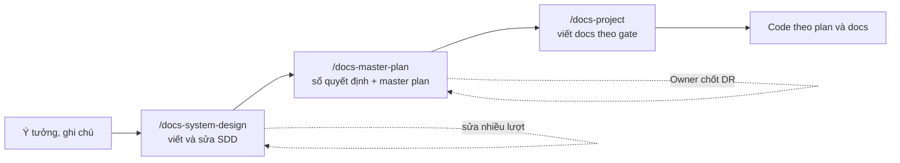

# design-docs-skills

Bộ ba agent skill đi từ ý tưởng tới bộ tài liệu thiết kế đủ để code mà không phải hỏi thêm: **SDD → sổ quyết định và master plan → bộ docs theo doc gate**.

*Three agent skills that take a project from an idea to an implementation-ready doc set: system design document → decision register and master plan → gated project docs. Skill content is written in Vietnamese.*



| Skill | Đầu vào | Đầu ra |
| --- | --- | --- |
| `docs-system-design` | Ý tưởng, ghi chú, hoặc một SDD có sẵn | `<du-an>-sdd.md`: bối cảnh, bài toán cốt lõi, phạm vi, yêu cầu, kiến trúc, các mục miền đi sâu (bất biến, máy trạng thái, tranh chấp, phân tích phương án), dữ liệu, API, giao diện, chịu lỗi, thực nghiệm, kế hoạch, rủi ro. Sửa được qua nhiều lượt trong cùng phiên |
| `docs-master-plan` | File SDD | `docs/00-decision-register.md` (mỗi chỗ SDD chưa nói "chính xác như thế nào" là một DR có phương án đề xuất), `docs/00-master-plan.md` (tài liệu cần viết kèm nội dung bắt buộc và gate, việc từng phase kèm tiêu chí nghiệm thu, ma trận truy vết), `docs/README.md` |
| `docs-project` | Master plan và sổ quyết định | Các tài liệu `DOC-xx`, ADR, runbook, thực nghiệm, đặc tả màn hình…, viết theo đúng nội dung bắt buộc và gate trong plan |

## Cài đặt

Cần [Node.js](https://nodejs.org) cho `npx`, và Python 3.10+ cho các script kiểm tra đi kèm skill.

```bash
# Cài cả ba skill cho Claude Code, dùng ở mọi dự án
npx skills add ninggiangboy/design-docs-skills -g -a claude-code

# Chỉ cài vào dự án hiện tại (.claude/skills/), để commit cùng repo
npx skills add ninggiangboy/design-docs-skills -a claude-code

# Chọn từng skill
npx skills add ninggiangboy/design-docs-skills --skill docs-system-design

# Xem danh sách skill trong repo
npx skills add ninggiangboy/design-docs-skills --list

# Cập nhật, gỡ
npx skills update
npx skills remove docs-system-design docs-master-plan docs-project
```

`npx skills` cài được cho cả agent khác (Codex, Cursor, OpenCode, Gemini CLI…): bỏ `-a claude-code` để chọn trong danh sách.

Cài tay:

```bash
git clone https://github.com/ninggiangboy/design-docs-skills.git
cp -r design-docs-skills/skills/* ~/.claude/skills/
```

## Cách dùng

### 1. Viết SDD

```text
/docs-system-design Hệ thống quản lý kho cho chuỗi cửa hàng, đồ án tốt nghiệp,
trọng tâm là đồng bộ tồn kho giữa các chi nhánh khi mất mạng.
```

Skill hỏi những điều làm thay đổi thiết kế, gửi dàn ý để duyệt, rồi viết từng mục. Sau đó cứ nói tiếp trong cùng phiên, mỗi lượt skill đọc lại file, sửa tối thiểu và sửa theo mọi chỗ bị ảnh hưởng:

```text
Mục 8 thêm phân tích phương án: CRDT, event sourcing, khóa trung tâm.
Giữ hàng 15 phút thay vì 10.
Dời phòng chờ sang "Để sau".
Rà lại toàn bộ cho nhất quán.
```

### 2. Lập sổ quyết định và master plan

```text
/docs-master-plan warehouse-sdd.md
```

Đọc các DR, rồi chốt:

```text
/docs-master-plan apply-decisions
Chấp nhận toàn bộ đề xuất, trừ DR-07: dùng RabbitMQ thay Kafka.
```

### 3. Viết docs theo plan

```text
/docs-project next          # tài liệu kế tiếp theo Phase 0
/docs-project gate P1       # mọi tài liệu có gate P1
/docs-project DOC-14        # một tài liệu cụ thể
/docs-project review all    # soát theo định nghĩa Approved
/docs-project status        # bảng DOC × gate × trạng thái
```

### Kết quả

```text
<du-an>-sdd.md
docs/
  README.md
  00-master-plan.md
  00-decision-register.md
  01-product/        vision, persona, requirements, use case, feature catalog
  02-glossary.md
  03-architecture/   context và container, luồng dữ liệu, contract, quality attributes, stack
  04-adr/
  05-data/           nguồn, mô hình dữ liệu, DQ rule, phân quyền DB, vòng đời
  06-design/         mỗi thành phần một tài liệu, cùng security, observability, config, lỗi
  07-api/
  08-ux-ui/          IA, design system, mỗi màn hình một file, microcopy
  09-operations/     dev local, deploy, CI/CD, runbook, backup
  10-testing/        test strategy, thực nghiệm, demo script
```

Nhóm nào không áp dụng (không có UI, không có AI, không có thực nghiệm…) thì master plan tự bỏ.

## Phương pháp

- **Doc gate.** Mỗi phase có việc `Pn-00`: phase chỉ bắt đầu khi các tài liệu nó cần đã `Approved`.
- **Sổ quyết định.** Không quyết định ngầm trong thân tài liệu: mọi lựa chọn chưa có trong SDD là một DR có trạng thái `Đề xuất → Chốt/Đổi`, ghi người chốt và tài liệu đích. DR cấp kiến trúc thành ADR.
- **Mã định danh thống nhất.** `FR`, `NFR`, `UC`, `F-<NHÓM>`, `DOC`, `ADR`, `DR`, `Pn-xx`, `S`, `E`, `DQ`, `EXP`, `RB`, tiền tố test riêng cho từng tài liệu. Script kiểm tra mọi mã được trỏ tới đều có định nghĩa.
- **Một nguồn sự thật.** Thuật ngữ ở glossary, key cấu hình ở configuration reference, metric ở observability, bảng ở tài liệu data, endpoint ở danh mục API.
- **Ngôn ngữ.** Mặc định `docs/` viết theo ngôn ngữ của SDD (thường là tiếng Việt); code, UI, log, commit bằng tiếng Anh. Đổi được khi lập plan.

Khung tài liệu rút từ hai dự án thật: một pipeline dữ liệu cho đồ án nghiên cứu (49 tài liệu, 32 ADR, khoảng 110 DR) và một hệ đặt vé chịu tải cao.

## Cấu trúc repo

```text
skills/
  docs-system-design/   SKILL.md, references/ (structure, style, revision), scripts/check_sdd.py
  docs-master-plan/     SKILL.md, references/ (conventions, decision-register, doc-catalog, master-plan, templates), scripts/check_docs.py
  docs-project/         SKILL.md, references/ (conventions, doc-guide, templates), scripts/check_docs.py
scripts/validate.py     kiểm tra frontmatter, link, file dùng chung, và chạy script kiểm tra trên fixture
tests/fixtures/         SDD và cây docs mẫu, cả bản đúng lẫn bản hỏng
```

Mỗi skill tự chứa đủ file để cài riêng lẻ, nên `conventions.md`, `templates.md` và `check_docs.py` có hai bản. Bản gốc nằm ở `docs-master-plan`; sửa ở đó rồi chạy:

```bash
python3 scripts/validate.py --fix   # chép file dùng chung sang docs-project
python3 scripts/validate.py         # CI chạy lệnh này trên mỗi push và PR
```

Các script kiểm tra cũng chạy được độc lập:

```bash
python3 skills/docs-system-design/scripts/check_sdd.py my-sdd.md --outline
python3 skills/docs-project/scripts/check_docs.py docs --strict
```

## License

[MIT](LICENSE)
