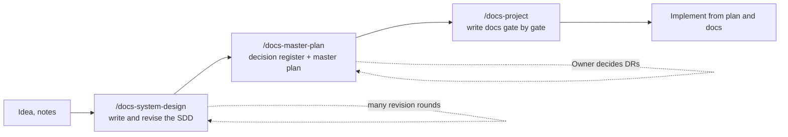

# design-docs-skills

Three agent skills that take a project from an idea to a documentation set complete enough to implement without asking: **system design document → decision register and master plan → gated project docs**. The documents are written in the language you choose; templates and fixed labels ship for eight languages, and any other language works through a generated vocabulary.



| Skill | Input | Output |
| --- | --- | --- |
| `docs-system-design` | An idea, notes, or an existing SDD | `<project>-sdd.md`: context, core problem, scope, requirements, architecture, deep domain sections (invariants, state machines, races, options analysis), data, API, UI, fault tolerance, experiments, plan, risks. Revised over many turns in the same session |
| `docs-master-plan` | The SDD | `docs/00-decision-register.md` (every place the SDD does not say "exactly how" becomes a DR with a proposed option), `docs/00-master-plan.md` (documents to write with required content and gates, tasks per phase with acceptance criteria, traceability matrix), `docs/README.md` |
| `docs-project` | The master plan and decision register | The `DOC-xx` documents, ADRs, runbooks, experiments, screen specs…, each matching its required content and gate in the plan |

## Install

Requires [Node.js](https://nodejs.org) for `npx`, and Python 3.10+ for the checker scripts bundled with the skills.

```bash
# All three skills for Claude Code, available in every project
npx skills add ninggiangboy/design-docs-skills -g -a claude-code

# Only for the current project (.claude/skills/), committed with the repo
npx skills add ninggiangboy/design-docs-skills -a claude-code

# Pick individual skills
npx skills add ninggiangboy/design-docs-skills --skill docs-system-design

# List the skills in this repository
npx skills add ninggiangboy/design-docs-skills --list

# Update, remove
npx skills update
npx skills remove docs-system-design docs-master-plan docs-project
```

`npx skills` also installs for other agents (Codex, Cursor, OpenCode, Gemini CLI…): drop `-a claude-code` to choose from a list.

Manual install:

```bash
git clone https://github.com/ninggiangboy/design-docs-skills.git
cp -r design-docs-skills/skills/* ~/.claude/skills/
```

## Usage

### 1. Write the SDD

```text
/docs-system-design An inventory system for a chain of stores, a graduation thesis,
focused on keeping stock consistent between branches while offline.
```

The skill first asks which language to write in, then asks only what changes the design, sends an outline for approval, and writes section by section. Keep talking in the same session; each turn re-reads the file, edits minimally, and updates everything the change affects:

```text
Add an options analysis to section 8: CRDTs, event sourcing, a central lock.
Hold stock for 15 minutes instead of 10.
Move the waiting room to "Later".
Run a full consistency pass.
```

### 2. Build the decision register and master plan

```text
/docs-master-plan inventory-sdd.md
```

The skill always asks for the document language and the language of code, UI and commits, and records both in §0.1 of the plan. Read the DRs, then decide:

```text
/docs-master-plan apply-decisions
Accept every proposal except DR-07: use RabbitMQ instead of Kafka.
```

### 3. Write the docs from the plan

```text
/docs-project next          # next document from Phase 0
/docs-project gate P1       # every document gated by P1
/docs-project DOC-14        # one specific document
/docs-project review all    # review against the Approved definition
/docs-project status        # DOC × gate × status table
```

### Result

```text
<project>-sdd.md
docs/
  README.md
  00-master-plan.md
  00-decision-register.md
  01-product/        vision, personas, requirements, use cases, feature catalog
  02-glossary.md
  03-architecture/   context and containers, data flows, contracts, quality attributes, stack
  04-adr/
  05-data/           sources, data model, data quality rules, DB roles, lifecycle
  06-design/         one document per component, plus security, observability, configuration, errors
  07-api/
  08-ux-ui/          IA, design system, one file per screen, microcopy
  09-operations/     local dev, deployment, CI/CD, runbooks, backup
  10-testing/        test strategy, experiments, demo script
```

Groups that do not apply (no UI, no AI, no experiments…) are left out by the master plan.

## Languages

Asked once per project, on first use, even when it looks obvious; recorded in master plan §0.1 and used by every later step.

- **Shipped vocabularies** in `skills/*/locales/`: English (`en`), Vietnamese (`vi`), Japanese (`ja`), Simplified Chinese (`zh`), Korean (`ko`), French (`fr`), Spanish (`es`), German (`de`). Each maps the 263 fixed headings and labels of the templates (SDD sections, master plan, decision register, ADR, use case, endpoint, screen, experiment, runbook…) and lists number, date and punctuation conventions.
- **Any other language**: the skill translates the English vocabulary itself and stores it as Appendix B of the master plan, so every document keeps the same terms. The checker scripts read that appendix too.
- IDs (`FR-01`, `DOC-14`), status values (`Draft`, `Approved`…), code, file and folder names stay the same in every language.

To add a shipped language, copy `locales/en.md` in `skills/docs-master-plan/`, add a third column, fill the Conventions section, and run `python3 scripts/validate.py --fix`.

## Method

- **Doc gates.** Every phase has a task `Pn-00`: a phase starts only when the documents it needs are `Approved`.
- **Decision register.** No silent decisions inside documents: every choice the SDD does not make is a DR (`Proposed → Decided / Changed`) with who decided it and which documents it goes into. Architecture-level DRs become ADRs.
- **Stable identifiers.** `FR`, `NFR`, `UC`, `F-<GROUP>`, `DOC`, `ADR`, `DR`, `Pn-xx`, `S`, `E`, `DQ`, `EXP`, `RB`, and one test-ID prefix per document. The checker verifies every referenced ID is defined.
- **Single source of truth.** Terms in the glossary, configuration keys in the configuration reference, metrics in observability, tables in the data documents, endpoints in the API catalog.

The structure was distilled from two real projects: a research data pipeline (49 documents, 32 ADRs, about 110 DRs) and a ticket booking system built for correctness under high load.

## Repository layout

```text
skills/
  docs-system-design/   SKILL.md, references/ (language, structure, style, revision), locales/, scripts/check_sdd.py
  docs-master-plan/     SKILL.md, references/ (language, conventions, decision-register, doc-catalog, master-plan, templates), locales/, scripts/check_docs.py
  docs-project/         SKILL.md, references/ (language, conventions, doc-guide, templates), locales/, scripts/check_docs.py
scripts/validate.py     frontmatter, links, locale consistency, shared-file sync, checker scripts on fixtures
tests/fixtures/         sample SDDs and docs trees, valid and broken, in several languages
```

Each skill is self-contained so it can be installed alone; shared files (`locales/`, `language.md`, `conventions.md`, `templates.md`, `check_docs.py`) therefore exist in more than one skill. The source copy lives in `docs-master-plan`; edit it there, then:

```bash
python3 scripts/validate.py --fix   # copy shared files to the other skills
python3 scripts/validate.py         # CI runs this on every push and pull request
```

The checker scripts also run standalone:

```bash
python3 skills/docs-system-design/scripts/check_sdd.py my-sdd.md --outline
python3 skills/docs-project/scripts/check_docs.py docs --strict
```

## License

[MIT](LICENSE)
