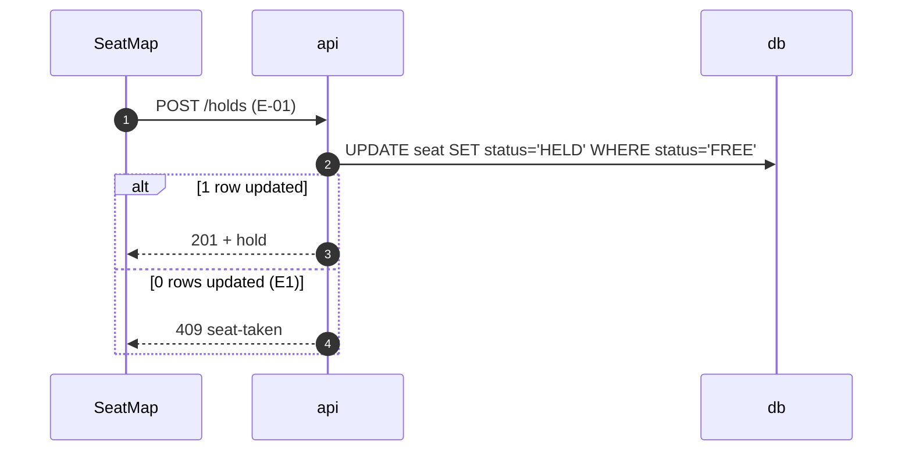

# Detailed flows: booking

> Status: **Review** · Updated: 2026-10-05 · DOC-04
> Depends on: [DR](../../00-decision-register.md) (DR-01, DR-02), [DOC-05](../../07-api/api-endpoints.md)

## FL-01 · Customer holds a seat

- **UC / FR:** UC-01, FR-01 · **Screen:** [seat map](../../08-ux-ui/screens/seat-map.md) · **Endpoints:** E-01

The conditional `UPDATE` is the arbiter (DR-01). The hold lasts 10 minutes (DR-02).

### Required tests

| ID | Scenario | Expected |
| --- | --- | --- |
| H-01 | 2 concurrent holds on A-12 | 1 × 201, 1 × 409 `seat-taken` |
| H-02 | Hold, wait 10 min 1 s | Seat is free again |

## Open questions

- Hold length: proposed 10 minutes, waiting for DR-02.
