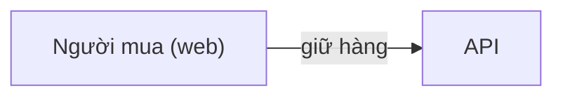

# Mini Shop — Thiết kế hệ thống

Oct 5, 2026 · @tester

Một cửa hàng nhỏ bán hàng có hạn; không bao giờ bán vượt tồn kho.

## 1. Giới thiệu

### 1.1 Bối cảnh

Hàng hóa hữu hạn, nhiều người mua cùng lúc (mục 2.1).

## 2. Mục tiêu, phạm vi và trọng tâm

### 2.1 Bài toán cốt lõi

> Làm sao không bán vượt khi nhiều request cùng tranh một món hàng?

### 2.2 Yêu cầu

| Mã | Yêu cầu | Chỉ tiêu |
| --- | --- | --- |
| FR-01 | Giữ hàng nguyên tử | — |
| NFR-01 | Không bán vượt | 0 đơn vượt tồn kho (EXP-01) |

## 3. Kiểm thử

### 3.1 Thực nghiệm

| Mã | Thực nghiệm | Cách làm | Chỉ số | Kỳ vọng |
| --- | --- | --- | --- | --- |
| EXP-01 | Tranh một món | 1.000 request đồng thời | Số đơn thành công | Đúng 1, theo FR-01 |
